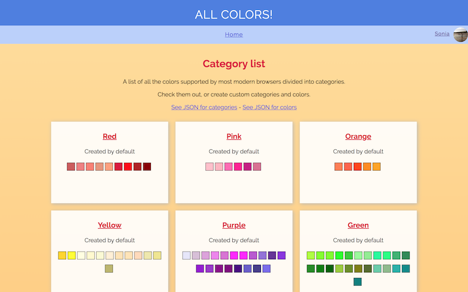
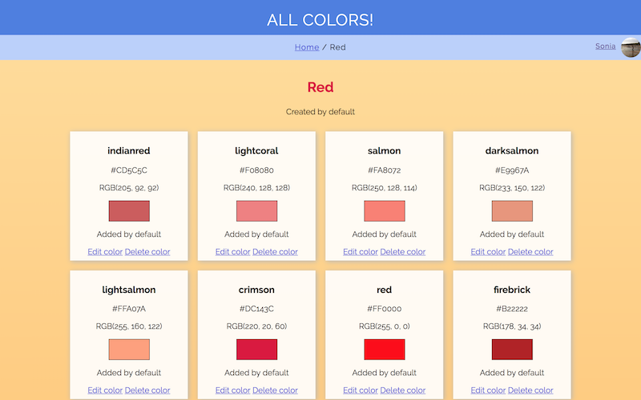
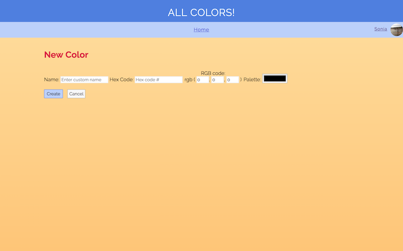

# Item Catalog

## Project Description

This is a project made for the completion of the Udacity's [Full Stack Web Developer Nanodegree](https://www.udacity.com/course/full-stack-web-developer-nanodegree--nd004).

## Instructions

Create an application that provides a list of items within a variety of categories as well as provide a user registration and authentication system. Registered users will have the ability to post, edit and delete their own items.

## How to start

1. Download and install [VirtualBox](https://www.virtualbox.org/wiki/Downloads) and [Vagrant](https://www.vagrantup.com/downloads.html). You can get the configuration file, as well as detailed instructions on how to install VirtualBox and Vagrant [here](https://github.com/udacity/fullstack-nanodegree-vm).
2. Make sure you have the latest version of [Python](https://www.python.org/download/releases/3.0/) installed;
3. You will also need a Google API key to enable the Login with Google feature. To do this, visit [https://console.developers.google.com/apis](https://console.developers.google.com/apis). Then, create your credentials, and download them as a JSON file. Place the file in the repository root and rename it as `client_secrets.json`.
4. Download this repository and cd into it in the terminal;
5. On the terminal, input `vagrant up` to launch the virtual machine, then `vagrant ssh` to continue;
6. Input `cd /vagrant`;
7. Load the database using `python models.py`, and then `python addcolors.py`;
8. Run the command `python views.py`;
9. Visit [http://localhost:8000](http://localhost:8000) to view the project.

## Project description

This is a catalog of all the colors supported by modern browsers, which are added by default and divided into 10 categories.

- Red;
- Pink;
- Orange;
- Yellow;
- Purple;
- Green;
- Blue;
- Brown;
- White;
- Gray.

For each color, the data recorded is:

- Name;
- Hex Code;
- Rgb Code;

It is possible to browse each category and the respective colors, as well as create new categories and colors, and edit and remove existing ones. However, while visibility is unrestricted, to make any additions, edits, or deletions, you must be logged in with a Google account (upper right corner on the header).

When creating or editing a new color, it is possible to input either the Rgb code, the Hex code, or choose a color from the palette. The remaining fields will be updated automatically. The only field not dependent on the others is "Name".

It is also possible to check the JSON endpoints for categories and colors from the homepage.
